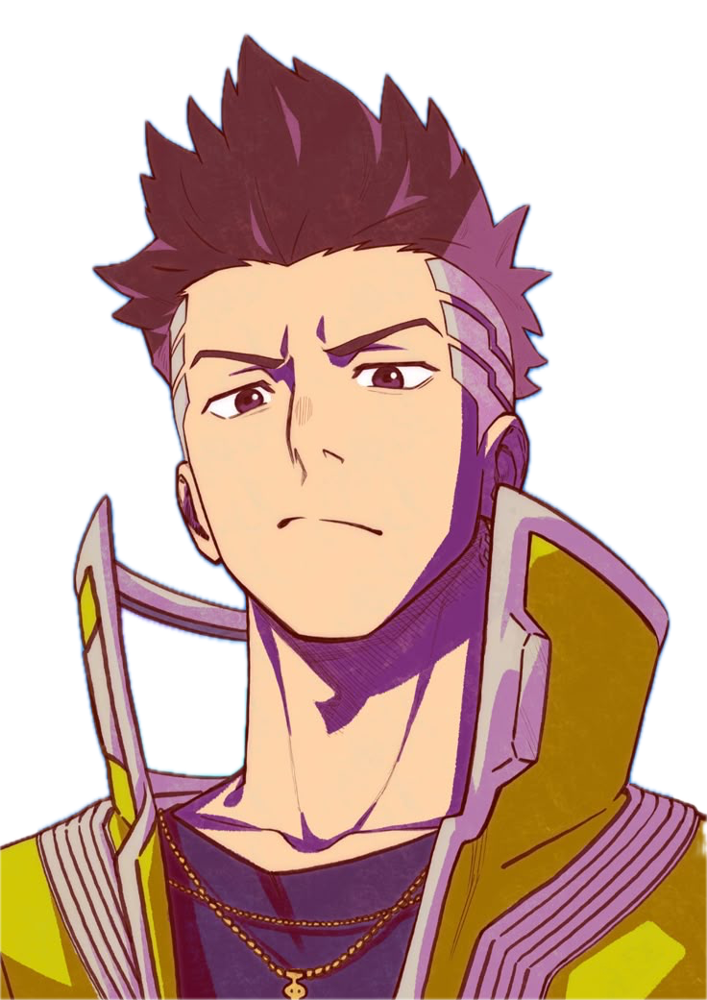

# PlayZone

   

PlayZone is an interactive platform that brings together gamers from different backgrounds and skill levels to connect, compete, and have fun. This project features a dynamic and visually engaging UI built with React, GSAP animations, and Tailwind CSS.

---

## 🚀 Features

-  **Dynamic Animations**: Smooth and interactive animations powered by GSAP.
-  **Responsive Design**: Fully responsive layout using Tailwind CSS.
-  **Interactive Components**:
   -  **Navbar**: Auto-hides on scroll and blends seamlessly with the background.
   -  **Hero Section**: Video-based hero section with scroll-triggered animations.
   -  **About Section**: Engaging content with animated titles and clip-path effects.
   -  **Bento Cards**: Hover-triggered autoplay videos with tilt effects.
-  **Reusable Components**: Modular and reusable components like `Button`, `AnimatedTitle`, and `BentoTilt`.

---

## 🛠️ Tech Stack

-  **Frontend**: React, TypeScript
-  **Styling**: Tailwind CSS
-  **Animations**: GSAP (GreenSock Animation Platform)
-  **Icons**: React Icons
-  **Utilities**: `react-use` for hooks like `useWindowScroll`

---

## 🖼️ Key Components

### 1. **Navbar**

-  Auto-hides on scroll and reappears when scrolling up.
-  Blends with the background using `mix-blend-mode`.

### 2. **Hero Section**

-  Features a video-based hero with GSAP animations triggered by scroll.
-  Includes interactive buttons and dynamic transitions.

### 3. **About Section**

-  Animated titles with GSAP scroll-triggered effects.
-  Clip-path animations for background images.

### 4. **Bento Cards**

-  Hover-triggered autoplay videos.
-  Tilt effects based on mouse position.

---

PlayZone is an interactive platform that brings together gamers from different backgrounds and skill levels to connect, compete, and have fun. This project features a dynamic and visually engaging UI built with React, GSAP animations, and Tailwind CSS.

---

## 🚀 Features

-  **Dynamic Animations**: Smooth and interactive animations powered by GSAP.
-  **Responsive Design**: Fully responsive layout using Tailwind CSS.
-  **Interactive Components**:
   -  **Navbar**: Auto-hides on scroll and blends seamlessly with the background.
   -  **Hero Section**: Video-based hero section with scroll-triggered animations.
   -  **About Section**: Engaging content with animated titles and clip-path effects.
   -  **Bento Cards**: Hover-triggered autoplay videos with tilt effects.
-  **Reusable Components**: Modular and reusable components like `Button`, `AnimatedTitle`, and `BentoTilt`.

---

## 🛠️ Tech Stack

-  **Frontend**: React, TypeScript
-  **Styling**: Tailwind CSS
-  **Animations**: GSAP (GreenSock Animation Platform)
-  **Icons**: React Icons
-  **Utilities**: `react-use` for hooks like `useWindowScroll`

---

## 🖼️ Key Components

### 1. **Navbar**

-  Auto-hides on scroll and reappears when scrolling up.
-  Blends with the background using `mix-blend-mode`.

### 2. **Hero Section**

-  Features a video-based hero with GSAP animations triggered by scroll.
-  Includes interactive buttons and dynamic transitions.

### 3. **About Section**

-  Animated titles with GSAP scroll-triggered effects.
-  Clip-path animations for background images.

### 4. **Bento Cards**

-  Hover-triggered autoplay videos.
-  Tilt effects based on mouse position.

---
